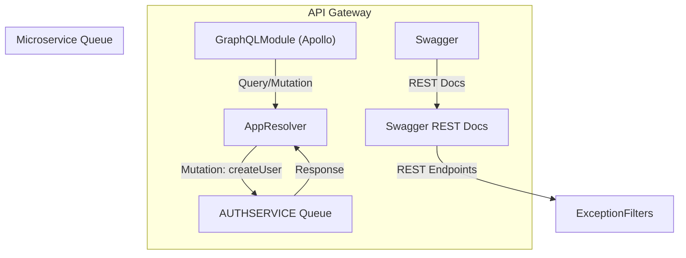

# API Gateway Documentation

## 📚 Overview

The API Gateway serves as the **unified entry point** for both **GraphQL** and **REST** APIs in the QuickPost system. It proxies requests to microservices over RabbitMQ and handles validation, exception transformation, and documentation exposure.

---

## 🚀 Features

* GraphQL API via `@nestjs/graphql` + Apollo
* REST API auto-docs via Swagger
* RabbitMQ client integration for `AUTH_SERVICE`
* Exception filters for HTTP and GraphQL
* Extended logger with persistent log file

---

## 🧱 Architecture



---

## 📦 Modules

### 🔹 `GqlModule`

Responsible for setting up the GraphQL API with auto-generated schemas.

* Schema generated to `apps/api-gateway/schema.gql`
* Uses `ApolloDriver`
* GraphQL Playground enabled

### 🔹 `SwaggerConfigModule`

Adds REST API documentation using Swagger only in **non-production** environments.

* Route: `/api/docs`
* JWT bearer authentication configured

---

## 🔌 Microservice Integration

Registered via `ClientsModule.registerAsync`:

```ts
transport: Transport.RMQ,
queue: 'auth_queue',
heartbeat: 30,
```

Sends and receives messages using `ClientProxy`.

---

## 🎯 GraphQL Resolver

`AppResolver` contains GraphQL `Mutation` and `Query` logic.

```ts
@Mutation(() => User)
async createUser(...) {
  const createdUser = await lastValueFrom(
    this.authClient.send('create_user', createUserInput)
  );
  return createdUser;
}
```

Handles `RpcException` errors via `rpcToGraphQLError()` for proper formatting.

---

## 🛡 Global Exception Filters

Registered in `main.ts`:

```ts
app.useGlobalFilters(
  new GraphqlExceptionFilter(),
  new HttpExceptionFilter()
);
```

Ensures all errors are transformed to a consistent GraphQL or REST response format.

---

## 🧪 Dev Experience

* Swagger UI: [`http://localhost:3000/api/docs`](http://localhost:3000/api/docs)
* GraphQL: [`http://localhost:3000/api/graphql`](http://localhost:3000/api/graphql)

> Introspection is enabled and headers are persisted across sessions.

---

## 📁 File Structure (Relevant)

```
apps/api-gateway/
├── src/
│   ├── app/
│   │   ├── app.module.ts         # Gateway config and microservice setup
│   │   ├── app.resolver.ts       # GraphQL logic
│   ├── gql/
│   │   └── gql.module.ts         # GraphQLModule config
│   ├── swagger-config/
│   │   └── swagger-config.module.ts # Swagger setup
│   └── main.ts                  # App bootstrap and logger setup
```

---

## ✅ Health Checklist

* [x] GraphQL schema available
* [x] Swagger UI reachable
* [x] Message broker connected
* [x] Global error filters in place

---

## 🧠 Next Steps

* Add authentication middleware
* Introduce gateway-level caching
* Rate limiting for REST and GraphQL
