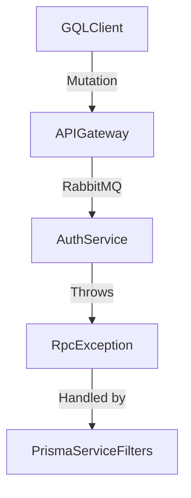

# Boundless Monorepo

Welcome to the **Boundless** monorepo! This project is designed for modular, scalable, and modern full-stack development using **NestJS**, **GraphQL**, **REST**, **Prisma**, **RabbitMQ**, and **Nx** for workspace orchestration.

## 🧠 Monorepo Structure

```bash
.
├── apps
│   ├── api-gateway     # Main gateway (GraphQL + Swagger)
│   └── auth             # Auth microservice (REST + RabbitMQ)
│
├── libs
│   └── prisma-service   # Shared Prisma client + exception filters + logger
│
├── docs                # Optional: architecture diagrams, request samples
└── README.md           # You're here!
```

## 📦 Tech Stack

* **Framework**: NestJS
* **Transport**: RabbitMQ (RMQ)
* **Database**: PostgreSQL via Prisma ORM
* **Client Communication**: GraphQL (Apollo), REST (Express)
* **Dev Tools**: Nx, PNPM, Terminus, Swagger

## 🧪 Services Overview

### 🛡️ `auth` Service

* RESTful microservice
* JWT-based authentication
* Prisma for user persistence
* Health checks: DB, Disk, RabbitMQ

### 🚪 `api-gateway`

* GraphQL interface via Apollo
* REST interface with Swagger Docs
* Communicates with microservices using RabbitMQ

### 🧬 `prisma-service`

* Centralized Prisma client
* Exception filters for HTTP/GraphQL/RPC
* Extended logger to file + console

## 🔗 Message Flow (Auth)



## ⚙️ Running the Project

```bash
pnpm install
nx serve api-gateway  # Gateway
nx serve auth         # Auth microservice
```

Or run with Docker:

```bash
pnpm nx run-many --target=docker-build --all
```

## 🩺 Health Checks

* Auth: `GET /api/health`
* Gateway: GraphQL introspection + REST Swagger docs

## 🗂️ Docs & Diagrams

Refer to `/docs` for diagrams and request samples (coming soon).

## 🤝 Contributing

1. Fork the repo
2. Create a feature branch
3. Submit a pull request with clear description

---

Made with ❤️ using Nx + NestJS
