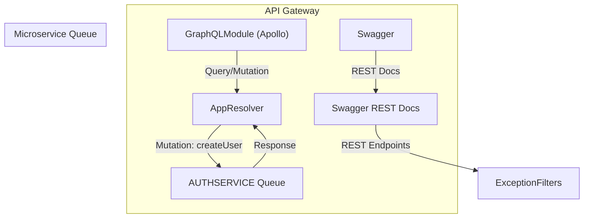

# API Gateway Documentation

## 📚 Overview

The API Gateway serves as the **unified entry point** for both **GraphQL** and **REST** APIs in the Boundless system. It proxies requests to microservices over RabbitMQ and handles validation, exception transformation, and documentation exposure.

---

## 🚀 Features

- GraphQL API via `@nestjs/graphql` + Apollo
- REST API auto-docs via Swagger
- RabbitMQ client integration for `AUTH_SERVICE`
- Exception filters for HTTP and GraphQL
- Extended logger with persistent log file

---

## 🧱 Architecture



---

## 🛠 Usage Guide

### 📌 Prerequisites

- Node.js v18+
- RabbitMQ server running
- PNPM dependencies installed (`pnpm install`)

### 🚦 Quick Start

```bash
nx serve api-gateway
```

**Access endpoints**:

- GraphQL Playground: `http://localhost:3000/api/graphql`
- Swagger UI: `http://localhost:3000/api/docs`

### 🔐 Authentication

```http
Authorization: Bearer <your_jwt_token>
```

### 📡 API Endpoints

#### GraphQL

**Base URL**: `/api/graphql`

**Example Mutation**:

```graphql
mutation CreateUser($input: CreateUserInput!) {
  createUser(createUserInput: $input) {
    id
    email
    createdAt
  }
}
```

### 🔧 Configuration

```env
RABBITMQ_URL=amqp://localhost:5672
AUTH_QUEUE=auth_queue
PORT=3000
```

---

## 📦 Modules

### 🔹 `GqlModule`

Responsible for setting up the GraphQL API with auto-generated schemas.

- Schema generated to `apps/api-gateway/schema.gql`
- Uses `ApolloDriver`
- GraphQL Playground enabled

### 🔹 `SwaggerConfigModule`

Adds REST API documentation using Swagger only in **non-production** environments.

- Route: `/api/docs`
- JWT bearer authentication configured

---

## 🔌 Microservice Integration

Registered via `ClientsModule.registerAsync`:

```ts
transport: Transport.RMQ,
queue: 'auth_queue',
heartbeat: 30,
```

Sends and receives messages using `ClientProxy`.

---

## 🎯 GraphQL Resolver

`AppResolver` contains GraphQL `Mutation` and `Query` logic.

```ts
@Mutation(() => User)
async createUser(...) {
  const createdUser = await lastValueFrom(
    this.authClient.send('create_user', createUserInput)
  );
  return createdUser;
}
```

Handles `RpcException` errors via `rpcToGraphQLError()` for proper formatting.

---

## 🐞 Debugging & Monitoring

**Common Issues**:

- RabbitMQ: Verify server running
- Schema: Run `nx build api-gateway`

**Health Checks**:

- `/api/health` - Application status

---

## 🧪 Dev Experience

- Swagger UI: [`http://localhost:3000/api/docs`](http://localhost:3000/api/docs)
- GraphQL: [`http://localhost:3000/api/graphql`](http://localhost:3000/api/graphql)

> Introspection is enabled and headers are persisted across sessions.

---

## ✅ Health Checklist

- [x] GraphQL schema available
- [x] Swagger UI reachable
- [x] Message broker connected
- [x] Global error filters in place

---

## 🚀 Deployment

Production build:

```bash
nx build api-gateway --prod
```

Recommended production settings:

```env
NODE_ENV=production
GRAPHQL_PLAYGROUND=false
```

---

## 🧠 Next Steps

- Add authentication Guards
- Introduce gateway-level caching
- Rate limiting for REST and GraphQL
