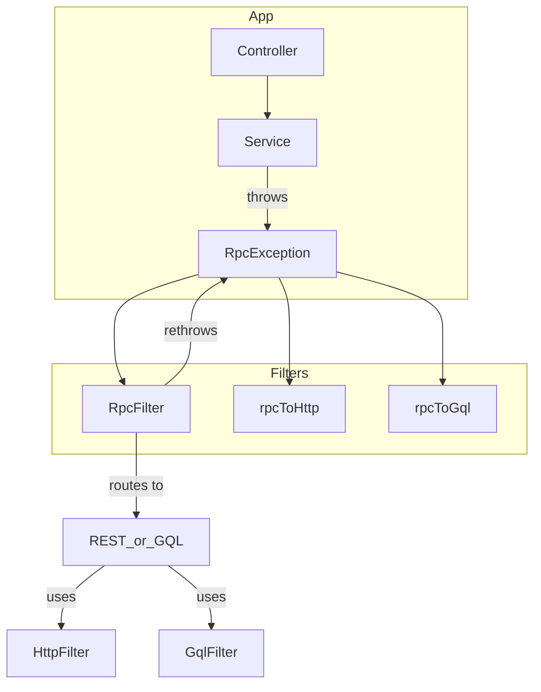

# 📦 Prisma Service Library

A shared NestJS-integrated library that centralizes Prisma database access, custom logging, and unified exception handling across microservices in the **Boundless** monorepo. This package enhances developer experience and runtime diagnostics by extending the Prisma client with:

* ✅ Centralized logging
* ⚠️ Unified exception transformation across RPC, GraphQL, and REST
* 🔍 Developer-friendly GraphQL + HTTP error codes
* 🧱 Prisma Accelerate extensions

---

## 🧪 Features

### 🔧 `PrismaService`

Extends `PrismaClient` with `onModuleInit` / `onModuleDestroy` lifecycle hooks for clean integration into NestJS DI. Includes Accelerate extension support:

```ts
@Injectable()
export class PrismaService extends PrismaClient implements OnModuleInit {
  ...
  this.$extends(withAccelerate());
}
```

---

### 📝 `ExtendedConsoleLogger`

Replaces the default NestJS logger with file + JSON logging capabilities:

* Stores logs in `logs/application.log`
* Automatically creates log directory if missing
* Structured JSON output (toggleable via `options.json`)

---

### 💥 Exception Handling

#### 🎯 `createRpcExceptionResponse`

Unifies RPC exceptions into a shape that can be consistently interpreted by:

* HTTP filters
* GraphQL exception filters
* Microservices (RMQ consumers)

#### 📚 Exception Filters

| Filter                   | Usage             | Description                            |
| ------------------------ | ----------------- | -------------------------------------- |
| `HttpExceptionFilter`    | REST Controllers  | Transforms & logs exceptions as JSON   |
| `GraphqlExceptionFilter` | GraphQL Resolvers | Maps HTTP codes to Apollo error format |
| `ExceptionFilter` (RPC)  | MessagePattern    | Returns raw `RpcException.getError()`  |

---

## 🌐 API Compatibility

### Supported:

* ✅ REST (via `@Catch(HttpException)`)
* ✅ GraphQL (via `GqlArgumentsHost`)
* ✅ RabbitMQ RPC (via `@Catch(RpcException)`)

### GraphQL Code Mapping

```ts
export enum GraphQLErrorCode {
  Conflict = 'CONFLICT',
  NotFound = 'NOT_FOUND',
  BadRequest = 'BAD_REQUEST',
  Unauthorized = 'UNAUTHORIZED',
  Forbidden = 'FORBIDDEN',
  InternalServerError = 'INTERNAL_SERVER_ERROR',
}
```

---

## 🗺️ Architecture Diagram



---

## 🛠️ Nx Commands

```bash
pnpm nx run prisma-service:prisma           # Run Prisma CLI
pnpm nx run prisma-service:migrate          # Apply DB migrations
pnpm nx run prisma-service:generate-types   # Generate Prisma client
pnpm nx run prisma-service:studio           # Launch Prisma Studio
```

---

## 📦 Exports

```ts
// NestJS modules can import from:
import {
  PrismaService,
  ExceptionFilter,
  GraphqlExceptionFilter,
  HttpExceptionFilter,
  createRpcExceptionResponse,
  ExtendedConsoleLogger,
} from '@boundless/prisma-service';
```

---

## 🧪 Future Enhancements

* [ ] Add e2e tests for each filter
* [ ] Support Sentry or structured observability
* [ ] Replace raw enums with i18n-ready error catalogs

---

## 💡 Contributing

Feel free to add more indicators (Redis, S3, etc.), or expand the exception mapping! This library is central to the developer experience — clean logs and clean errors make for a happy team. 🙌
