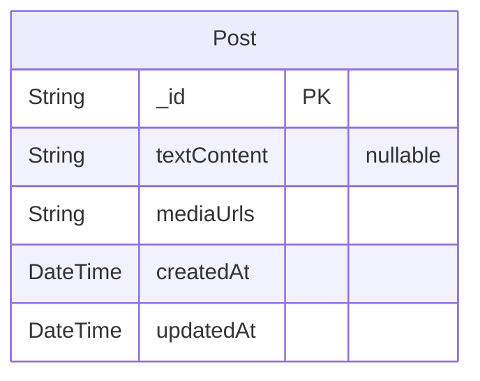

# Playing 

> Generated by [`prisma-markdown`](https://github.com/samchon/prisma-markdown)

- [default](#default)

## default

### `Post`

Defines the Post model for social media posts

Properties as follows:

- `_id`: Unique identifier (maps to MongoDB's _id)
- `textContent`: Optional text content of the post
- `mediaUrls`: Array of media URLs (photos/videos)
- `createdAt`: Timestamp of post creation
- `updatedAt`: Timestamp of last update
